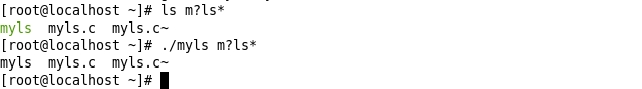

# Myls
  

自己编写的实现 Linux 系统下 ls 命令的代码。

## 算法分析
### 总体流程
1. 对输入的参数进行快速排序（sort），使得参数按字母顺序从 A 到 Z 排列；
2. 判断输入参数是文件夹还是文件，文件夹加入 pdhead 指向的链表，文件加入 phead 指向的链表；
3. 用 sortlslink 函数对文件链表 phead 排序，用 showlslink 函数对文件链表 phead 中的所有文件排版显示；
4. 用 lspath 函数依次对文件夹链表 pdhead 中的文件夹进行遍历并对文件夹内的文件进行排序并排版显示（ lspath 函数调用了 sortlslink 函数和 showlslink 函数，对文件夹内的文件夹进行递归调用）。

### 重要函数流程
* sortlslink 函数对链表进行冒泡排序，使得链表结点按字母顺序从A到Z排列；
* showlslink 函数根据参数-l选择输出文件全部属性（ format_long_print 函数）还是只输出文件名（ format_normal_print 函数）；
* format_normal_print 函数调用 pageMaker 函数进行排版，排版之后显示在终端上；
* pageMaker 函数先调用 getRows 函数计算排版后的行数；再调用 getColsList 函数计算每列的宽度；之后将排好序的文件名链表进行“置换”操作（“置换”之前输出到终端上是横着排列的从 A 到 Z，而“置换”之后输出到终端上是竖着排列的从 A 到 Z ）；最后在每个文件名后加入空格以达到所在列的宽度；
* getRows 函数获得终端的宽度，行数从 1 开始增加，计算当前行数对应需要的显示宽度（根据行数计算列数，找到每列最长的文件名，显示宽度等于每列最长文件名的长度相加再加上列之间的宽度），若显示宽度小于等于终端的宽度或者行数等于文件名数，则行数停止增加并返回这个行数；
* getColsList 函数根据行数计算列数并计算每列的文件名的最大长度并将其保存在 colsList 链表里。

## 改进结果
* `ls` 与 `./myls` 对比

* `./myls vmware-tools-distrib/` 与 `ls vmware-tools-distrib/` 对比

* `ls m*` 与 `./myls m*` 对比

* `ls m?ls*` 与 `./myls m?ls*` 对比

## 许可证
[MIT 许可证](LICENSE)
